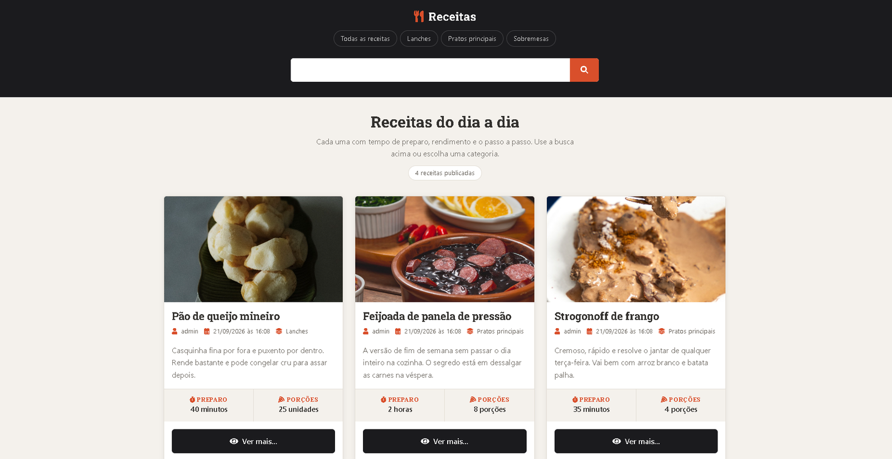

# Recipes

A recipe site built with Django. It's a study project, written test-first.

[](https://github.com/artvsantos/django-projeto1/actions/workflows/ci.yml)
[](https://www.djangoproject.com)
[](#tests)
[](LICENSE)

[Versão em português](README.md)



## What it does

- Home page listing published recipes, paginated
- Search by title or description
- Recipes filtered by category
- A page for each recipe
- Django admin for adding recipes and categories, with cover image upload

Pagination isn't Django's out of the box. There's a function in `utils/pagination.py` that builds the range of page numbers around the current page without running past either end of the list. It has the most edge cases in the project, and the most tests.

## Tests

37 tests, 98% coverage.

They cover the models, the URLs, all four views and the pagination range. Models, views and URLs sit at 100%; pagination is at 93%, and that's where the edge cases live.

Settings, migrations and the seed command are excluded from the measurement. They aren't application code, and counting them would only pad the number.

I use `parameterized` to check several fields without writing the same test five times over, and `Faker` builds the test recipes through a factory in `utils/recipes/factory.py`.

```bash
pytest

coverage run -m pytest
coverage report
coverage html   # browsable report at htmlcov/index.html
```

## Stack

Python 3.11, Django 5.2, SQLite, pytest, coverage, python-dotenv, Pillow.

## Running it locally

```bash
git clone https://github.com/artvsantos/django-projeto1.git
cd django-projeto1

python -m venv venv
source venv/bin/activate        # Windows: venv\Scripts\activate

pip install -r requirements.txt
pip install -r requirements-dev.txt   # only if you want to run the tests

cp .env-exemple .env            # Windows: copy .env-exemple .env
# change SECRET_KEY in .env

python manage.py migrate
python manage.py createsuperuser
python manage.py runserver
```

It runs at http://localhost:8000, and the admin is at /admin.

A recipe only shows up on the site once `is_published` is checked.

## Project layout

```
projeto/          settings, urls, wsgi/asgi
recipes/          main app
  models.py       Recipe and Category
  views.py        home, search, category, recipe
  tests/          the test suite
  templates/      pages and partials
utils/
  pagination.py   page range calculation
  recipes/        factory for fake recipes
base_templates/   base template
base_static/      global css
```

## License

MIT. See [LICENSE](LICENSE).
